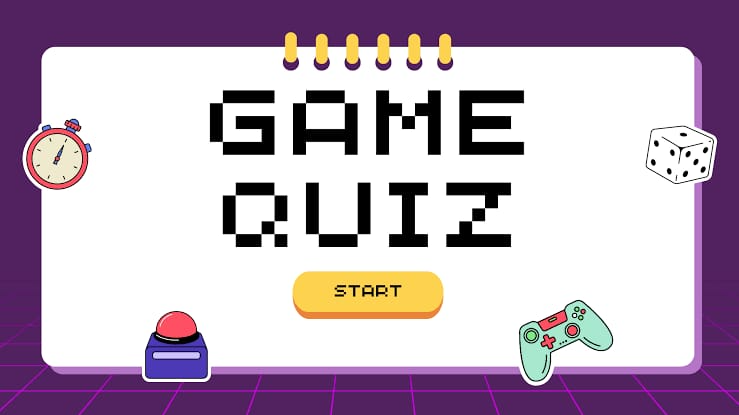

🧠Quiz Game
An interactive web-based quiz game that tests users' knowledge across various topics! Built with HTML, CSS, and JavaScript, it features multiple-choice questions, scoring, and instant feedback.

🧩 Features :
✅ Multiple-choice questions

✅ Real-time score tracking

✅ Timer-based quiz rounds (optional)

✅ Feedback for correct and incorrect answers

✅ Responsive design for mobile and desktop

🚀 Technologies Used

  - HTML5
  - CSS3
  - JavaScript (Vanilla JS)

🔧 Setup Instructions
Clone the repository:

Copy code
git clone https://github.com/your-username/quiz-game.git
Navigate to the project directory:

Copy code
cd quiz-game
Open index.html in your browser to start the game.

📁 File Structure
pgsql
Copy code
quiz-game/
├── index.html
├── style.css
├── script.js
└── README.md

🧠 How to Play

 - Start the quiz by clicking the Start button.

 - Choose the correct answer from the given options.

 - Get instant feedback after each question.

 - Your final score will be shown at the end.

🌐 Contribution
Contributions are welcome!
If you're part of GSSoC or any other open-source program, feel free to open an issue and submit a pull request.

Fork the repo

Create a new branch: git checkout -b feature-name

Commit your changes

Push to your fork and submit a PR

📄 License
This project is licensed under the MIT License.

🤝 Acknowledgements
Thanks to GirlScript Summer of Code (GSSoC) for the opportunity to contribute!